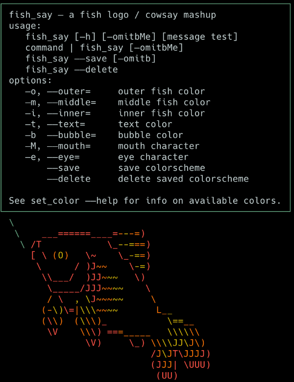

# fish_say - A fish_logo / cowsay mashup

[](https://www.tldrlegal.com/l/mit)

This plugin adds a function to make the [fish-shell](http://fish.sh) ASCII-art logo speak! It's completely ridiculous and unnecessary, but was a fun project for learning to write code for fish. I've used bash and zsh for a few decades, but have only been using fish for a few weeks, so I'm sure there's much in this code that should be improved.



##  💾 Installation
#### System Requirements
- Version 3.3.1 or later of the [Fish Shell](https://fishshell.com)

#### Install with [Fisher](https://github.com/jorgebucaran/fisher):
```console
fisher install drbarrett/fish_say
```

## Usage
[`fish_say -h`](assets/fish_say_help.png) to get help
    ```code
    fish_say - a fish logo / cowsay mashup
    usage:
       fish_say [-h] [-omitbMe] [message test]
       command | fish_say [-omitbMe]
       fish_say --save [-omitb]
       fish_say --delete
    options:
       -o, --outer=     outer fish color
       -m, --middle=    middle fish color
       -i, --inner=     inner fish color
       -t, --text=      text color
       -b  --bubble=    bubble color
       -M, --mouth=     mouth character
       -e, --eye=       eye character
           --save       save colorscheme
           --delete     delete saved colorscheme
    ```
Tab completion is enabled and is helpful for selecting colors. See [set_color](https://fishshell.com/docs/current/cmds/set_color.html) --help for additional info on available colors.


## Examples
**Pipe text to fish_say**
`fortune | fish_say`
**Get text from the command line**
`fish_say 'Hi, I'm a talking fish`
**Multiline**
`fish_say 'line 1' 'line 2' 'line 3'`
**Change Appearance**
`fish_say -o white -m brblack -i white --mouth=O --eye=X "I'm dead jim"`
**Save Configuration**
`fish_say -o blue -m cyan -i green -b yellow -t white --save`
**Delete Configuration**
`fish_say --delete`
**Add to fish_greeting**
You can enjoy this foolishness every time the shell loads by adding this to your fish greeting (`~/.config/fish/functions/fish_greeting.fish`):

```console
    function fish_greeting
        fortune | fish_say
    end
```

## Credits & Inspiration
- [fish_logo](https://github.com/laughedelic/fish_logo): original inspiration and I stole the fish graphic from here as well.
- [cowsay](https://github.com/tnalpgge/rank-amateur-cowsay): The fortune command isn't nearly as much fun when it isn't piped through cowsay and lolcat.
- [lolcat](https://github.com/busyloop/lolcat)
